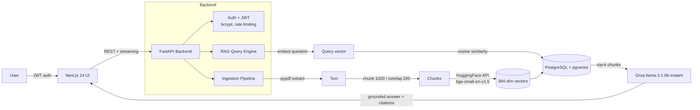

<div align="center">

# 🧠 DocuMind

### Chat with your PDFs — an end-to-end RAG (Retrieval-Augmented Generation) platform

Upload a document, ask questions in plain English, and get grounded answers **with citations** back to the exact source passages.

[](https://github.com/962003/DocuMind/actions/workflows/ci.yml)


</div>

---

## 📌 What it does

DocuMind is a full-stack **Retrieval-Augmented Generation** application. It lets a user securely upload PDFs, automatically indexes them into a vector database, and answers natural-language questions using a large language model **constrained to the document's content** — so answers stay factual and every claim links back to a source snippet.

> **Why it matters:** This is the same architecture behind "chat with your docs" products (Notion AI Q&A, ChatPDF, enterprise knowledge assistants). It demonstrates auth, an async ingestion pipeline, vector search, LLM orchestration, streaming responses, and a containerized cloud deployment — built as one cohesive product.

---

## 🖼️ Screenshots

> 📷 _Add your own screenshots to `docs/screenshots/` (filenames below) and they'll render here automatically._

| Login / Sign-up | Upload & Indexing |
|:---:|:---:|
|  |  |

| Chat with Citations | Previous Chats / History |
|:---:|:---:|
|  |  |

---

## 🏗️ Architecture



**Flow in one line:** `Upload PDF → extract text → chunk → embed → store vectors → ask question → retrieve nearest chunks → LLM answers from context → return answer + citations`.

---

## ✨ Features

- 🔐 **JWT Authentication** — sign-up / login with bcrypt-hashed passwords, strong-password validation, and per-user document isolation.
- 📄 **PDF Upload & Validation** — type/size checks (25 MB cap), rejects empty or non-PDF files.
- ⚙️ **Automatic Indexing Pipeline** — text extraction → recursive chunking (1000 chars, 200 overlap) → embeddings → vector storage, with a live `index_status` (`pending → completed / failed`).
- 🔎 **Semantic Vector Search** — pgvector cosine-similarity retrieval over `bge-small-en-v1.5` embeddings.
- 💬 **Grounded Q&A with Citations** — answers are constrained to retrieved context; each response includes source snippets + similarity scores.
- ⚡ **Streaming Responses** — token-by-token streaming endpoint for a real-time chat feel.
- 🕘 **Chat History** — per-document conversation history with a context window of recent turns.
- 🛡️ **Rate Limiting** — configurable per-minute request throttling on protected routes.
- 🔁 **Pluggable LLMs** — switch between Groq, Google Gemini, or OpenRouter via config.
- 🐳 **One-command Deploy** — Dockerized backend + frontend with a guided AWS EC2 deploy script.
- ✅ **CI Pipeline** — automated tests + lint on every push (GitHub Actions).

---

## 🛠️ Tech Stack

| Layer | Technology |
|---|---|
| **Frontend** | Next.js 14, React 18, Tailwind CSS, Axios |
| **Backend** | FastAPI, Python 3.12, Uvicorn, Pydantic v2 |
| **Database** | PostgreSQL + **pgvector** (Supabase), SQLAlchemy 2.0, Alembic migrations |
| **Embeddings** | HuggingFace Inference API — `BAAI/bge-small-en-v1.5` (384-dim) |
| **LLM** | Groq `llama-3.1-8b-instant` (default) · Gemini / OpenRouter optional |
| **RAG tooling** | LangChain text splitters, pypdf |
| **Auth & Security** | JWT (python-jose), passlib + bcrypt, rate limiting, CORS |
| **Infra / DevOps** | Docker, Docker Compose, AWS EC2, Vercel (UI), GitHub Actions CI |

---

## 📡 API Documentation

Base URL (local): `http://127.0.0.1:8000` · Interactive docs auto-generated at **`/docs`** (Swagger UI) and **`/redoc`**.

🔑 = requires `Authorization: Bearer <token>` header.

| Method | Endpoint | Auth | Description |
|---|---|:---:|---|
| `GET`  | `/health` | — | Service + LLM configuration status |
| `POST` | `/auth/signup` | — | Register a user, returns a JWT |
| `POST` | `/auth/login` | — | Authenticate, returns a JWT |
| `GET`  | `/auth/me` | 🔑 | Current authenticated user |
| `POST` | `/upload` | 🔑 | Upload & index a PDF (multipart) |
| `GET`  | `/documents` | 🔑 | List the user's documents |
| `GET`  | `/document-status/{document_id}` | 🔑 | Indexing status of a document |
| `POST` | `/ask` | 🔑 | Ask a question → answer + citations |
| `POST` | `/ask/stream` | 🔑 | Ask a question → streamed answer |
| `GET`  | `/ask/questions/{document_id}` | 🔑 | Previously asked questions |
| `GET`  | `/ask/history/{document_id}` | 🔑 | Full chat history for a document |

<details>
<summary><b>Sample request / response — <code>POST /ask</code></b></summary>

**Request**
```json
{
  "question": "What is the refund policy?",
  "document_id": "3f2a9c1e-...-9b",
  "top_k": 5
}
```

**Response**
```json
{
  "answer": "Refunds are available within 30 days of purchase...",
  "document_id": "3f2a9c1e-...-9b",
  "citations": [
    {
      "chunk_id": "c1",
      "chunk_index": 4,
      "score": 0.83,
      "snippet": "Customers may request a refund within thirty (30) days..."
    }
  ]
}
```
</details>

---

## 🚀 Deployment Guide

### Prerequisites
- A **Supabase** Postgres database with the `vector` extension enabled
- A **Groq** API key (free tier) — and optionally a HuggingFace token for embeddings

### Option A — Local (Docker Compose, recommended)

```bash
# 1. Clone
git clone https://github.com/962003/DocuMind.git
cd DocuMind

# 2. Configure backend environment
cp rag-backend/.env.example rag-backend/.env   # then edit the values below

# 3. Build & run both services
docker compose up --build
```

Then open:
- **Frontend** → http://localhost:3000
- **API docs** → http://localhost:8000/docs

### Option B — One-command AWS EC2 deploy

```bash
./deploy.sh      # installs Docker, validates .env, migrates DB, starts containers
```

### Required environment variables (`rag-backend/.env`)

| Variable | Description |
|---|---|
| `DATABASE_URL` | Supabase Postgres connection string |
| `GROQ_API_KEY` | LLM provider key (from console.groq.com) |
| `HF_API_TOKEN` | HuggingFace token for embeddings (optional) |
| `JWT_SECRET` | Secret for signing JWTs — **change in production** |
| `FRONTEND_URL` / `ALLOWED_ORIGINS` | CORS configuration |

> The frontend reads `NEXT_PUBLIC_API_BASE_URL` to locate the backend.

---

## 🧪 Manual Test Guide

A 2-minute smoke test to verify the full flow end-to-end.

### 1. Backend is healthy
```bash
curl http://127.0.0.1:8000/health
# Expect: {"status":"ok","llm_provider":"groq","llm_configured":true,...}
```

### 2. Create an account → get a token
```bash
curl -X POST http://127.0.0.1:8000/auth/signup \
  -H "Content-Type: application/json" \
  -d '{"name":"Demo","email":"demo@example.com","password":"Demo@1234","confirm_password":"Demo@1234"}'
# Expect: {"access_token":"<JWT>","token_type":"bearer","expires_in":86400}
```
Save the token:
```bash
TOKEN="<paste access_token here>"
```

### 3. Upload a PDF
```bash
curl -X POST http://127.0.0.1:8000/upload \
  -H "Authorization: Bearer $TOKEN" \
  -F "file=@/path/to/your.pdf"
# Expect: {"message":"...","chunks_created":N,"document_id":"<uuid>","index_status":"completed"}
```
```bash
DOC="<paste document_id here>"
```

### 4. Ask a question
```bash
curl -X POST http://127.0.0.1:8000/ask \
  -H "Authorization: Bearer $TOKEN" \
  -H "Content-Type: application/json" \
  -d "{\"question\":\"Summarize this document\",\"document_id\":\"$DOC\",\"top_k\":5}"
# Expect: {"answer":"...","citations":[{...}]}
```

### 5. UI walkthrough
1. Go to `http://localhost:3000` → **Sign up**.
2. **Upload** a PDF → watch the status flip to *completed*.
3. **Ask** a question → answer appears with citation snippets.
4. Reload → the conversation persists under **Previous Chats**.

### Test matrix (expected behaviour)

| Action | Expected result |
|---|---|
| Upload a `.txt` file | `400 Only PDF files allowed` |
| Upload an empty PDF | `400 Empty file upload` |
| Any protected call without a token | `401 Invalid or expired token` |
| Ask before indexing completes | `409 Document is not ready` |
| Valid upload + ask | Grounded answer with citations |

### Automated tests
```bash
cd rag-backend
pytest tests/ -v        # runs in CI on every push
```

---

## 📂 Project Structure

```
DocuMind/
├── rag-backend/          # FastAPI app
│   ├── app/
│   │   ├── api/routes/    # auth, upload, ask, documents, status, health
│   │   ├── services/      # ingestion, embeddings, llm, chat_history
│   │   ├── models/        # SQLAlchemy: users, documents, chunks, chats
│   │   ├── schemas/       # Pydantic request/response models
│   │   └── core/          # config, security, rate limiting
│   ├── tests/             # pytest suite
│   └── alembic/           # DB migrations
├── rag-ui/               # Next.js 14 frontend
│   └── app/               # pages, components, api/auth libs
├── docker-compose.yml    # backend + frontend
├── deploy.sh             # AWS EC2 deployment script
└── .github/workflows/    # CI pipeline
```

---

<div align="center">

**Built with FastAPI, Next.js, and pgvector.** ⭐ Star the repo if you find it useful!

</div>
